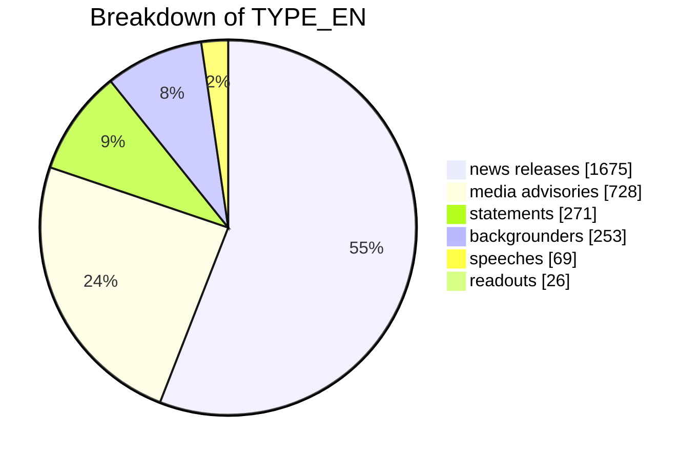
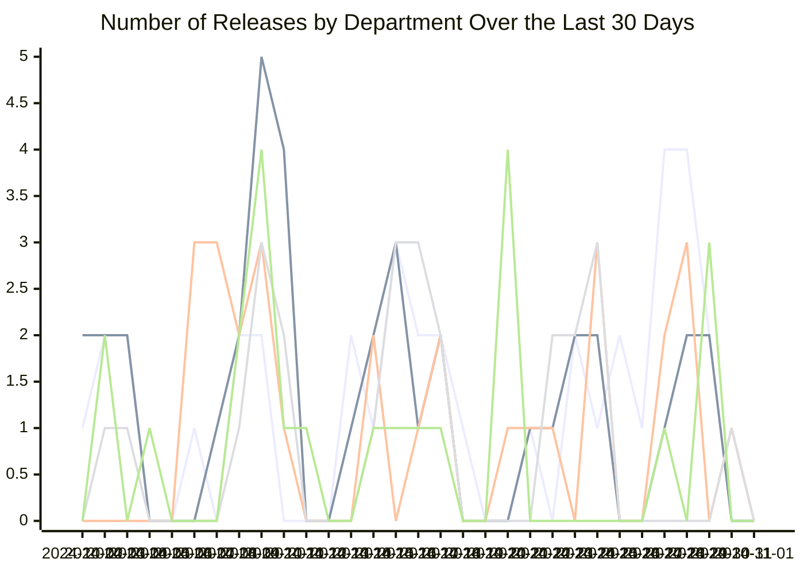
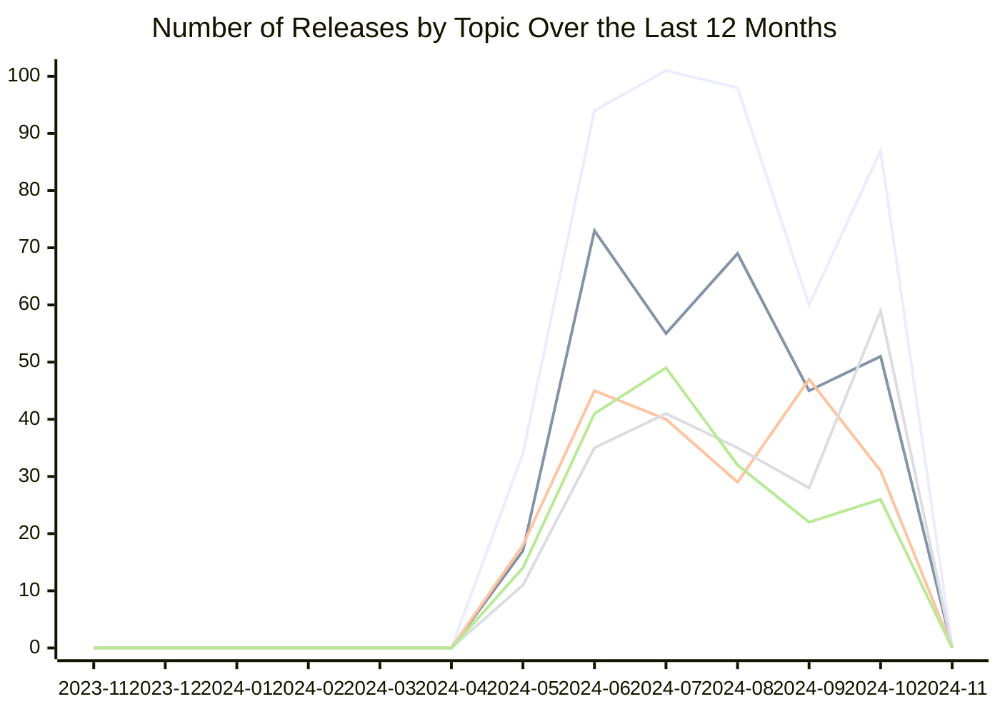

# Government of Canada News Releases Analysis

This repository contains analyses of Government of Canada news releases. The following charts provide insights into the data.

## Breakdown of Release Types

## Releases by Department Over the Last 30 Days

## Releases by Topic Over the Last 12 Months

