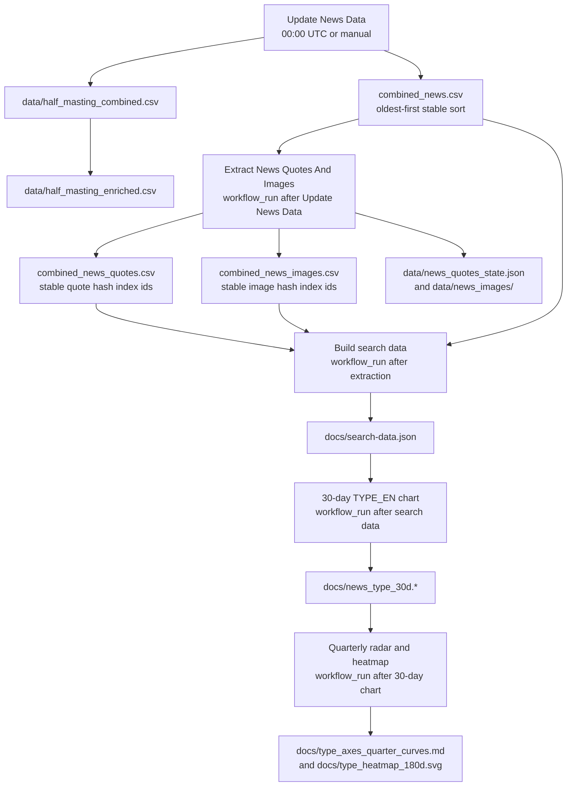

# Government of Canada News Releases Analysis

 - all news items

This repository collects, normalizes, and analyzes bilingual Government of Canada news content from [canada.ca](https://www.canada.ca/). Its main purpose is to maintain a structured English/French news dataset that can be used for trend analysis, chart generation, and downstream extraction tasks such as quote and image collection.

## What The Repo Does

The repository has four main functions:

1. Build and update a combined bilingual news dataset from the Government of Canada news feeds.
2. Derive secondary datasets from each article, including quoted statements and article images.
3. Scrape and enrich related public-service content such as half-masting notices.
4. Publish lightweight visual summaries of the dataset in `docs/`.

## Main Datasets

### `combined_news.csv`

This is the core dataset of the project. It merges the English and French `news.datatable.json` feeds into one bilingual CSV. Each row represents a single news item and includes:

- publication date
- English and French title text
- English and French article URLs
- teaser text
- audience, type, department, location, minister, topic, and subject metadata
- a `hash` field used as a stable row identifier

This file is the source for most of the analyses and derived outputs in the repo.

### `combined_news_quotes.csv`

This derived dataset stores quote-level rows extracted from the actual article pages linked in `combined_news.csv`. One article can produce multiple quote rows, one row, or none.

Each row includes:

- an `id`
- `hash`
- `PUBDATE`
- `TITLE_URL_EN`
- `TITLE_URL_FR`
- quote index within the article
- English quote text and speaker
- French quote text and speaker

Quotes are typically pulled from sections headed `Quotes` on English pages and `Citations` on French pages.

### `combined_news_images.csv`

This derived dataset stores image-level rows for images found inside the article body. It records:

- an `id`
- `hash`
- `PUBDATE`
- `TITLE_URL_EN`
- `TITLE_URL_FR`
- image index within the article
- saved filename
- English and French alt text
- file path inside the repository

Downloaded image files are stored under `data/news_images/<hash>/`.

The extractor intentionally skips generic Government of Canada branding assets such as `wmms-blk.svg` and `sig-blk-en.svg`.

### `data/half_masting_combined.csv`

This dataset stores bilingual half-masting notices scraped from the English and French notice pages and merged into a single CSV.

### `data/half_masting_enriched.csv`

This is an enriched version of the half-masting dataset with additional derived fields added by the enrichment script.

## Main Scripts

### `update_news_data.py`

This is the main dataset refresh script used by the automated workflow. It:

- downloads the latest English and French Government of Canada news JSON feeds
- normalizes and cleans text fields
- matches English and French items into bilingual rows
- extracts title text and title URLs from the HTML fragments in the feed
- computes a row hash
- merges new records into `combined_news.csv`
- preserves historical data while deduplicating by article identity

If you only want one script to understand the repo’s core data pipeline, start here.

### `scripts/extract_news_quotes.py`

This script reads `combined_news.csv` and visits the corresponding article pages. In a single pass it:

- extracts quote blocks from article pages
- extracts article-body images
- downloads images into the repository
- writes `combined_news_quotes.csv`
- writes `combined_news_images.csv`
- updates `data/news_quotes_state.json` so unchanged articles can be skipped on later runs

This keeps article-level enrichment incremental enough to run in GitHub Actions.

### `scripts/scrape_half_masting.py`

This scraper downloads English and French half-masting pages from `canada.ca`, parses the notice tables, and merges the two languages into `data/half_masting_combined.csv`.

### `scripts/enrich_halfmast.py`

This script enriches the half-masting dataset with additional derived information and saves the result to `data/half_masting_enriched.csv`.

### `news.py` and `update_news.py`

These are earlier or alternate versions of the news updater logic. They perform similar feed-merging work but `update_news_data.py` is the clearest current reference for the main pipeline.

### Chart And Analysis Scripts

Several small scripts generate summaries or charts from `combined_news.csv`, including:

- `12m.py`
- `30d.py`
- `pie.py`
- `region.py`
- `gen_readme.py`
- `scripts/make_mermaid_news_radchart.py`

These scripts are used to aggregate the news dataset into visual or textual summaries, mainly under `docs/`.

## GitHub Actions Workflows

### `.github/workflows/update_news.yml`

This workflow is the first scheduled automation stage. It:

- refreshes `combined_news.csv`
- runs the half-masting scraper to update `data/half_masting_combined.csv`
- runs half-masting enrichment to update `data/half_masting_enriched.csv`
- commits once after those source datasets are ready

### `.github/workflows/extract-news-quotes.yml`

This workflow runs after the main news update workflow succeeds. It:

- reads the latest `combined_news.csv`
- extracts quotes and images from article pages
- updates the derived CSVs and downloaded image assets
- writes stable quote and image row IDs based on article hash plus within-article index
- commits those outputs back to the repository

## Automation Order And Generated Outputs

The GitHub Actions workflows are intentionally chained so that each derived output is generated only after its source CSVs have settled. The shared `gc-news-data-pipeline` concurrency group lets one stage finish before the next stage writes to the branch, which avoids the earlier pattern where scheduled jobs could commit against stale intermediate data.

```mermaid
flowchart TD
    A[Update News Data<br/>00:00 UTC or manual] --> B[combined_news.csv<br/>oldest-first stable sort]
    A --> C[data/half_masting_combined.csv]
    C --> D[data/half_masting_enriched.csv]
    B --> E[Extract News Quotes And Images<br/>workflow_run after Update News Data]
    E --> F[combined_news_quotes.csv<br/>stable quote hash index ids]
    E --> G[combined_news_images.csv<br/>stable image hash index ids]
    E --> H[data/news_quotes_state.json<br/>and data/news_images/]
    F --> I[Build search data<br/>workflow_run after extraction]
    G --> I
    B --> I
    I --> J[docs/search-data.json]
    J --> K[30-day TYPE_EN chart<br/>workflow_run after search data]
    K --> L[docs/news_type_30d.*]
    L --> M[Quarterly radar and heatmap<br/>workflow_run after 30-day chart]
    M --> N[docs/type_axes_quarter_curves.md<br/>and docs/type_heatmap_180d.svg]
```

In short: the primary CSV is refreshed first, article-level CSVs are extracted second, search JSON is built third, and charts are rendered last in a serial order. Manual runs still work at each stage, but scheduled automation no longer builds HTML, search data, or charts in the middle of a multi-step CSV update.

## Repository Structure

- [README.md](C:/Users/Pat/Documents/New%20project/README.md): project overview
- [combined_news.csv](C:/Users/Pat/Documents/New%20project/combined_news.csv): primary bilingual news dataset
- [combined_news_quotes.csv](C:/Users/Pat/Documents/New%20project/combined_news_quotes.csv): derived quote-level dataset when generated
- [combined_news_images.csv](C:/Users/Pat/Documents/New%20project/combined_news_images.csv): derived image-level dataset when generated
- [scripts](C:/Users/Pat/Documents/New%20project/scripts): scrapers and enrichment jobs
- [data](C:/Users/Pat/Documents/New%20project/data): intermediate files, half-masting datasets, image downloads, and extractor state
- [docs](C:/Users/Pat/Documents/New%20project/docs): rendered charts and supporting visual artifacts
- [.github/workflows](C:/Users/Pat/Documents/New%20project/.github/workflows): scheduled automation definitions

## How The News Merge Works

The English and French feeds are not already linked by a shared explicit record id in the CSV export, so the merge logic relies on a bilingual pairing strategy based on:

- matching `PUBDATE`
- normalized minister name comparison

After pairing, the scripts preserve both language versions of the title, teaser, and metadata fields in a single row.

## Typical Use Cases

- tracking Government of Canada news output over time
- analyzing departments, topics, locations, and release types
- building quote corpora from official news releases
- collecting article images for archival or downstream analysis
- comparing English and French presentation of the same news item
- publishing static charts from the live feed

## Current Visual Example

### Breakdown of Release Types

