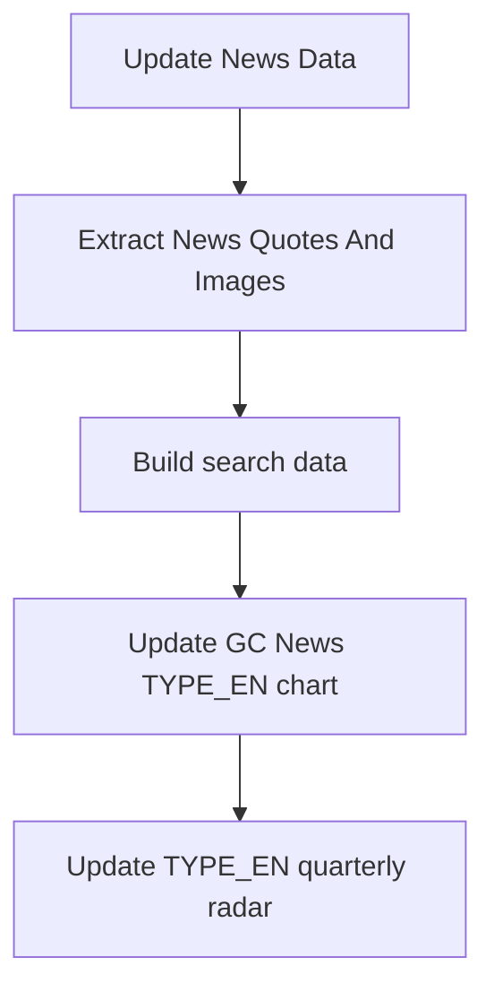

# Before / After: GitHub Actions Data Pipeline Refactor

## Before

- `Update News Data` committed in the middle of the pipeline, then a second `enrich-halfmast` job checked out the branch again and committed separately.
- The half-masting source HTML was downloaded between the news CSV refresh and later enrichment, but the scraper that produces `data/half_masting_combined.csv` was commented out. That meant enrichment could run against whatever CSV happened to already be in the repository.
- `Extract News Quotes And Images` ran after `Update News Data`, but `Build search data` also ran on every push to the source CSVs. Search JSON could therefore be rebuilt after `combined_news.csv` changed but before quote and image extraction finished.
- The chart workflows ran on independent schedules and downloaded `combined_news.csv` from `main`, so they could render while upstream CSV updates were still in progress or before derived CSVs/search data had settled.
- Quote and image CSV rows used sequential `id` values. When a newly discovered article appeared at the top of the sort order, a new row could become `id=1` and force every later row to receive a different ID.
- `combined_news.csv` was sorted newest first. New feed items landed at the top of the file, making CSV diffs noisy because every existing row shifted downward.
- Several workflows pushed independently without a shared concurrency group, which increased the chance of stale checkouts overwriting each other throughout the day.

## After

- `Update News Data` performs the primary feed refresh, half-masting scrape, and half-masting enrichment in one job and commits once after all source data is ready.
- `Extract News Quotes And Images` is still the second stage, but it now runs in the same `gc-news-data-pipeline` concurrency group as the rest of the pipeline.
- `Build search data` now runs after quote/image extraction succeeds instead of on every CSV push. This prevents search JSON from being built between the primary CSV update and the derived CSV update.
- The chart workflows now run after search data succeeds, and chart scripts read the checked-out `combined_news.csv` instead of fetching a potentially out-of-sync copy from `main`.
- Quote and image CSV IDs are stable composite IDs: `quote_<article hash>_<quote index>` and `image_<article hash>_<image index>`. Adding a new earlier article no longer renumbers every downstream row.
- `combined_news.csv` is sorted oldest first with a stable sort, so routine new items append near the end instead of shifting the whole file.
- Workflows pull with rebase immediately before pushing and only commit when staged files changed, reducing unnecessary writes.

## New Scheduled/Triggered Order

This keeps source CSV updates, derived CSV updates, search JSON, and rendered docs in a logical source-to-derived order.
