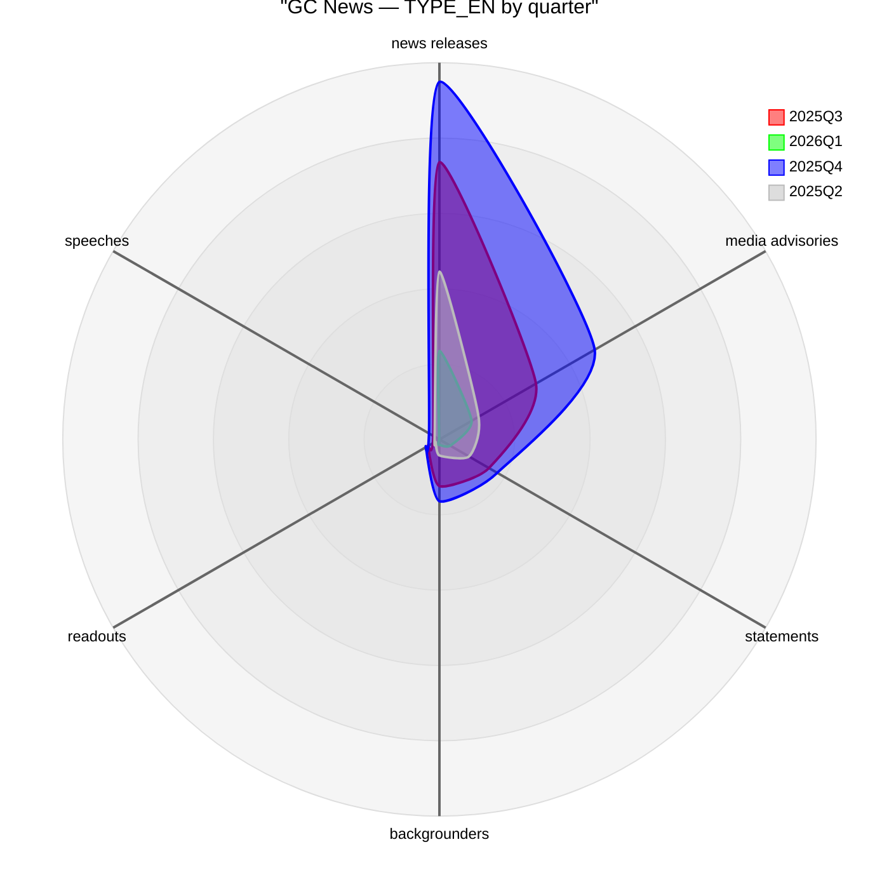

## TYPE_EN by Quarter (last 12 complete months)

```mermaid
---
config:
  radar:
    axisScaleFactor: 1
    curveTension: 0.1

  legendFontSize: 16
  axisLabelFontSize: 16
  
  theme: neutral
  themeVariables:
    cScale0: "#FF0000"
    cScale1: "#00FF00"
    cScale2: "#0000FF"
    
 
---

radar-beta
  title "GC News — TYPE_EN by quarter"
  axis t1["news releases"], t2["media advisories"], t3["statements"], t4["backgrounders"], t5["readouts"], t6["speeches"]

  
  curve q2["2025Q3"]{552, 222, 114, 93, 26, 14}
  curve q4["2026Q1"]{176, 74, 25, 11, 11, 1}
  curve q3["2025Q4"]{712, 357, 133, 123, 31, 24}
  curve q1["2025Q2"]{334, 90, 68, 32, 9, 11}


  max 750
  showLegend true
  graticule circle
  ticks 5
  
  
```
